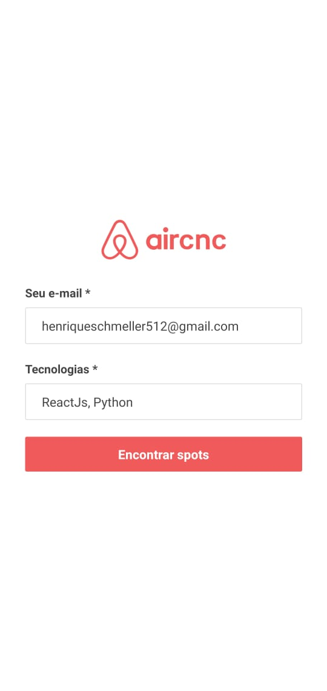
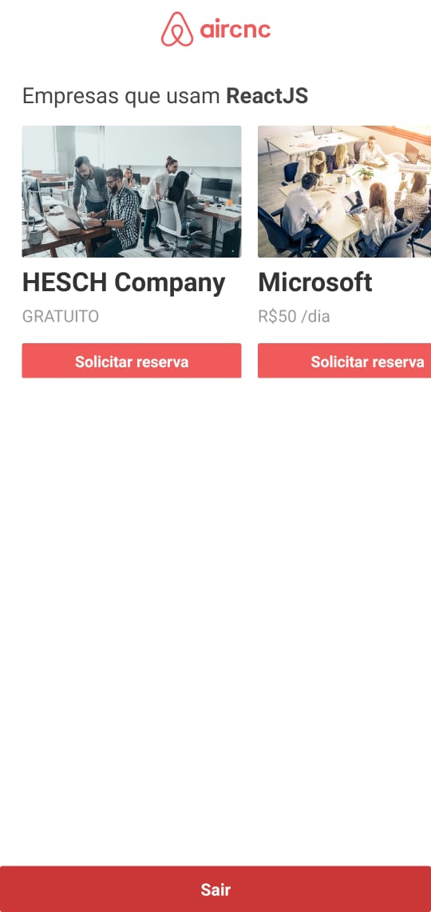
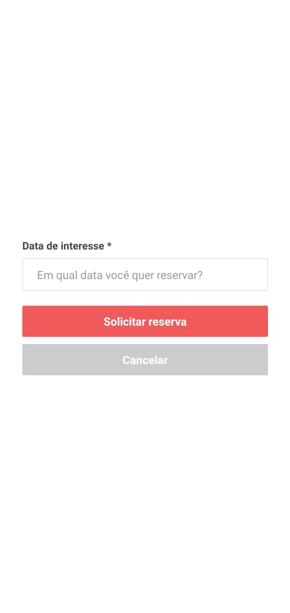

<h1>AirCnC</h1>
<h3>O projeto AirCnC é uma parodia ao AirBnB, o seu proposito é possibilitar que empresas oferecereçam espaços (gratuitos ou pagos) para que programadores possam vivenciar um pouco do ambiente, da cultura ou da empresa em sí, facilitando até uma possível contratação.</h3>

<h3>Cada Spot é cadastrado e filtrado por tecnologias que a empresa usa, um possível interessado por uma tecnologia X filtrará todos os Spots cadastrados que tenham a tecnologia X, podendo solicitar uma reserva em algum deles.</h3>

<h1>Como Rodar</h1>

* É necessário rodar o comando npm install em todas as pastas (Frontend, Backend e Mobile) para instalar as dependências.

* Para rodar o Mobile é necessário installar o React-Native Expo, rode o comando ``npm install -g expo-cli`` para instalar.

* É necessário possuir um cluster no MongoDB e conectá-lo no arquivo Server.js (Backend).

* É necessário configurar corretamente o IP e Postas para funcionar o envio e recebimento de imagem.

<h1>Login WEB</h1>

<h1>Cadastro de Spot</h1>

O processo de cadastro de Spot acontece via Web pela empresa.

<h1>Listagem de Spots Cadastrados</h1>

<h1>Login Mobile</h1>

<h1>Listagem de Spots</h1>

<h1>Reserva de Spot</h1>

<h1>TODO:</h1>

* Implementar "Solicitação em tempo real" por WebSockets

